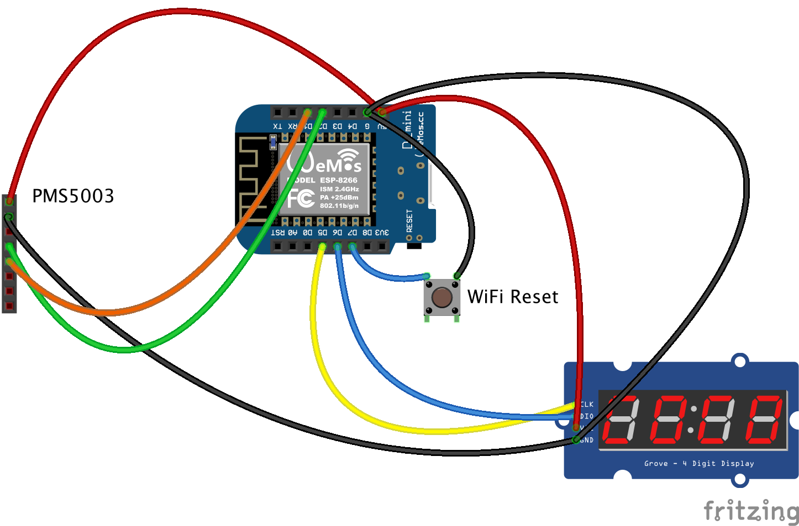

# ArduinoAQI

This device continuously monitors atmospheric particulate matter. It sends sensor data to a registered ThingSpeak channel and displays realtime Air Quality Index [calculations](https://en.wikipedia.org/wiki/Air_quality_index#United_States). It was designed to be cheap and efficient.

## Hardware
* ESP8266 Arduino-compatible microcontroller. I‘m using a [WeMos D1 mini](https://www.wemos.cc/en/latest/d1/d1_mini.html), pins will need to be transposed for other controllers
* [Plantower PMS5003](https://cdn-shop.adafruit.com/product-files/3686/plantower-pms5003-manual_v2-3.pdf) laser particle concentration sensor
* [TM1637](http://dx.com/p/0-36-led-4-digit-display-module-for-arduino-black-blue-works-with-official-arduino-boards-254978) seven segment LED display module
* A momentary switch for resetting the wifi configuration

## Dependencies
* A minimally hacked version (included in this repo) of tzapu’s [WiFiManager](https://github.com/tzapu/WiFiManager)
* [Arduino_JSON](https://github.com/arduino-libraries/Arduino_JSON)
* fu-hsi‘s [library](https://github.com/fu-hsi/PMS) for Plantower PMS x003 family sensors
* bremme‘s [library](https://github.com/bremme/arduino-tm1637) for controlling TM1637 display modules
* mathwork‘s [ThingSpeak library](https://github.com/mathworks/thingspeak-arduino) – note: latest version is buggy, use [release v1.4.3](https://github.com/mathworks/thingspeak-arduino/releases/tag/1.4.3) 
* madleech‘s [Button library](https://github.com/madleech/Button)

## Configuration

ArduinoAQI uses ThingSpeak for both uploading sensor data and for reading configuration. You will need a [ThingSpeak](https://thingspeak.com/) account and least two channels: a registration channel to store configuration and a data channel to write sensor data to. The registration channel should have three fields:

1. Device MAC Address
2. Data Channel ID
3. Data Channel Write API Key

The data channel should have four fields:

1. PM 1.0 (µg/m³)
2. PM 2.5 (µg/m³)
3. PM 10.0 (µg/m³)
4. AQI

You will need to upload or import data into the registration channel, with one data point per device containing the desired data channel ID and corresponding Write API Key.

Copy `config.h` to `private/config.h` and fill in at least `THINGSPEAK_REGISTRY_CHANNEL_NUMBER` and `THINGSPEAK_REGISTRY_API_KEY` with the ID of the ThingSpeak registration channel ID and corresponding *Read* API Key.

## Usage

To setup wifi connectivity, the device will create an *ArduinoAQI Setup* access point when first run. Connect to this network with a phone or computer to set your wifi credentials.

The device powers up in spinup mode for an initial ten seconds. Set wifi mode to **off** by clicking the reset button during spinup. In wifi mode, the reset button will clear your network credentials and relaunch the configuration access point.

## WeMos D1 mini Wiring Diagram

Also tested with a [WeMos D1 R2](ArduinoAQI_bb.png) development board. Note: Pin labels on the D1 R2 fritzing component are wonky.

## JavaScript Chart

See [ChartAQI](https://github.com/grotter/ChartAQI) to view your sensor data and any optional PurpleAir sensors.

### ♥ Antifascist Science Club
